# Vorau Choir

## Introduction

This website is the redesign of the existing homepage of [The Choir Vorau](http://www.mgv-vorau.at/), originally created in German. The Choir Vorau is a mixed-voice choir located in Vorau, Styria, Austria. The Vorau municipality is located in a culturally rich area, which attracts a lot of tourists. Vorau is especially famous for the historical abbey, where the choir organizes several concerts per year. The choir can also be heard during the regular singing rehearsal. Besides, the choir members organize other events, such as trips or singing with another choir. You can find the website [here](https://brodsa.github.io/mgv-vorau/).

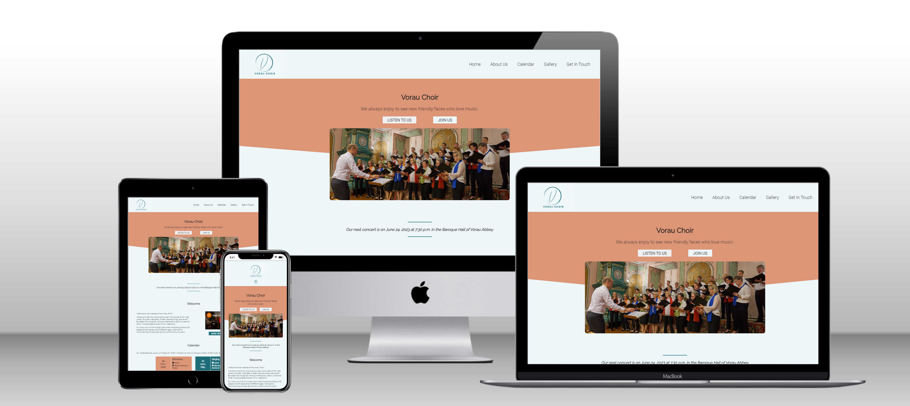

--- 
 

## UX
The purpose of the newly designed home page is mainly to enhance the presentation of the choir's activities. This should attract fans, tourists, and potentially new members of the Choir Vorau. In the future, the current members of the choir will also have the opportunity to see a detailed gallery of all past events and concerts.

### User Stories

- **First-Time Visitor Goals**
    - US1: As a first-time visitor, I want to easily navigate through the content of the webpage.
    - US2: As a first-time visitor, I want to visit the web page on my mobile phone.
    - US3: As a first-time visitor, I want to see samples of the visual or audio presentation of some past concerts.

- **Returning Visitor Goals**
    - US4: As a returning visitor, I want to check the upcoming events.
    - US5: As a returning visitor, I want to read about the choir and its members.
    - US6: As a returning visitor, I want to easily contact the choir.
    - US7: As a returning visitor, I want to follow the choir's activities on social media.

- **Frequent Visitor Goals**
    - US8: As a frequent user, I want to check the new upcoming events.
    - US9: As a frequent user, I want to see new photos or media from the choir activities.

### Wireframes
The wireframes were created using the program balsamiq. Two versions of the webpage were considered: mobile (left) and notebook (right).

- Home Page
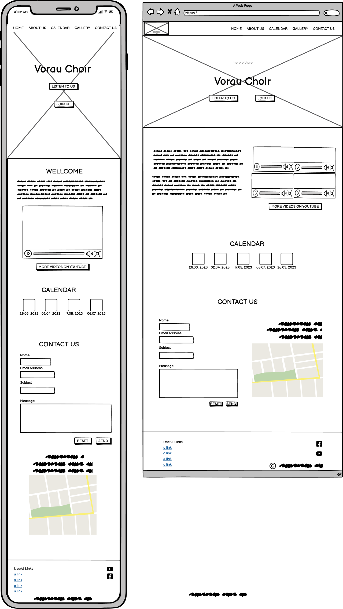

- About Us Page

- Gallery Page
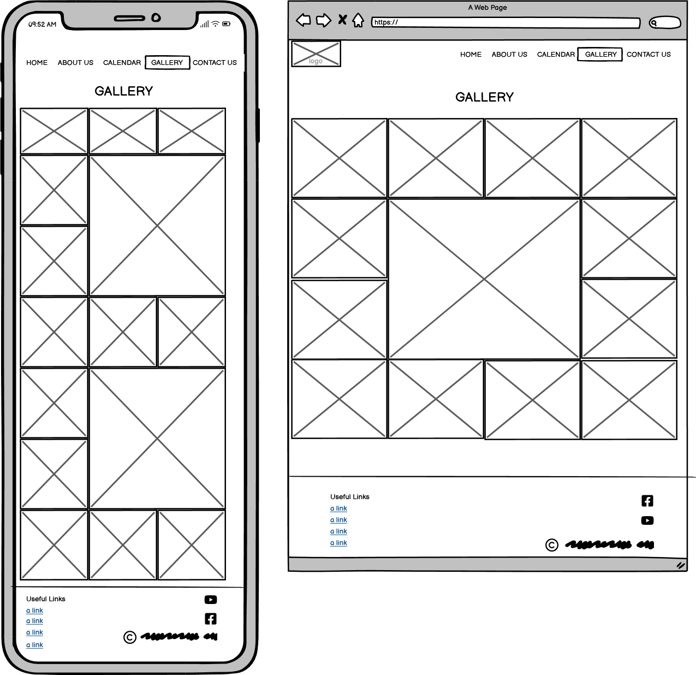

### Colours
The colour pallete was changed during the development of the homepage several times. The [initial colour schema](https://coolors.co/21b8a4-cecbcb-201f1f-f5f5f5) was chosen manually without checking the accessibility. After testing, it turned out that the colours are very poor in terms of accessibility. Therefore, new shema was selected based on the popular colour pallete, see [here](https://coolors.co/palette/006d77-83c5be-edf6f9-ffddd2-e29578). The colours also fit to the chosen photo in the hero section of the homepage.

The accessibility of the chosen colours was tested by the tool [toolness](https://github.com/toolness/accessible-color-matrix). The usage of the colour follows the adviced colour combinations, see the full report [here](https://toolness.github.io/accessible-color-matrix/?n=White&n=Black&n=Green&v=EBEBEB&v=201F1F&v=659B5E).
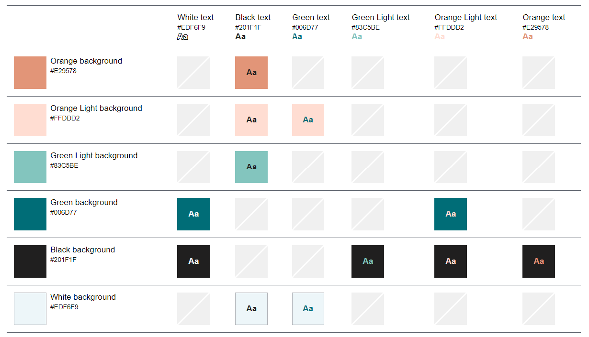

### Fonts
The heading font, Raleway, was selected after searching for the best fonts in 2023, see [here](https://kinsta.com/blog/best-google-fonts/#:~:text=Roboto.,appearances%20on%20Google%20Fonts'%20analytics.). The suitable body text font, Roboto, was chosen based on the [blog post](https://www.figma.com/google-fonts/raleway-font-pairings/#:~:text=Raleway%20font%20pairing,PT%20Sans%2C%20and%20Open%20Sans.) by Figma.
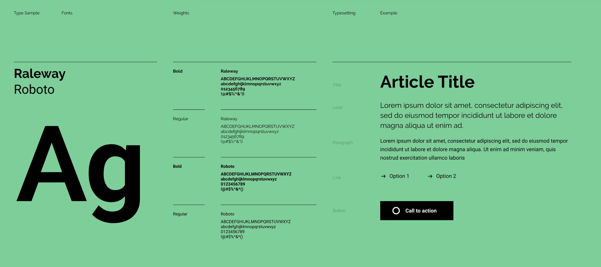

---
## Features
The layout of the webpage takes into account all eight user stories. Firstly, the entire webpage is desinged in a responsive way to ensure that the webpage is properly displaied on different devices (e.g. a mobile, a desktop). Secondly, the webpage consists of three sites, containing the common components, i.e. navigation menu and footer. This helps the user to easily navigate through the content of the webpage. Lastly, the webpage contains other components or elements which are common practise in webdesign, i.e. logo, hero picture, copyright notice or external links. 

### Common Features
-  **Navigation Menu**
    - All three web pages contain the logo and navigation menu (US1).
    - The navigation menu includes the following items (US1): 
        - *Home* navigates the user to the homepage.
        - *About Us* navigates the user to the About Us Page.
        - *Calendar* navigates the user to the Calender Section.
        - *Gallery* navigates the user to the Gallery Page.
        - *Get In Touch* navigates the user to the Get in Touch Section. 
    - The navigation menu is displayd as hamburger on the small devices (US2).
    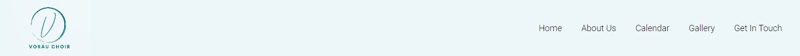

- **Footer**
    - The footer is a common component of all three webpages as the navigation menu.
    - The footer contains the links to the social media (US7, US9), contact information (US6) and the copyright notice.
    

### **Home Page Features**
The Home Page consists of 4 sections including the listed features:
 - **Hero Section** includes the name, slogan and photo of the choir. Additionaly, there are two buttons *Listen to Us* and *Join Us* resp. which directs the user to Calender (US4, US9) and Get In Touch (US6) resp. Section quickly.
 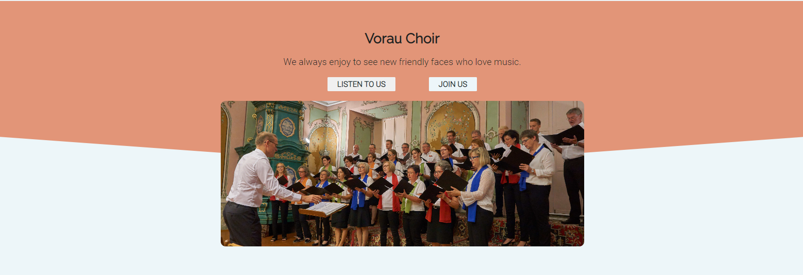

 - **News Banner** serves for important announcements, such as upcomming concerts, new published on-line videos or concert cancellation (US8).

 - **Welcome Section** introduces the choir briefly. An embedend Youtube video of the choir sining is included (US3). 
 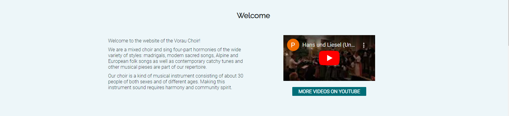

 - **Calendar Section** lists all upcoming concerts and singing rehearsal (US4, US8).
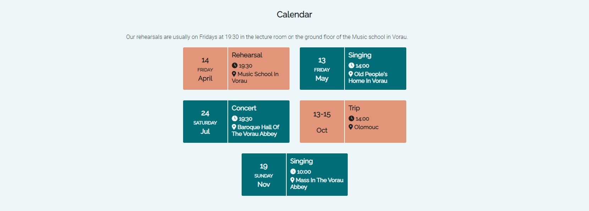

 - *Get In Touch Section* includes contact form and the rehearsal location (US6). 
 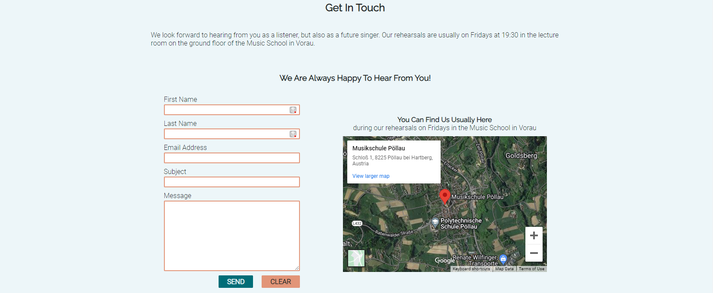

### **Gallery Page Features**
The Gallery Page contains a selection of the photos from the concerts or other events (US3, US9).
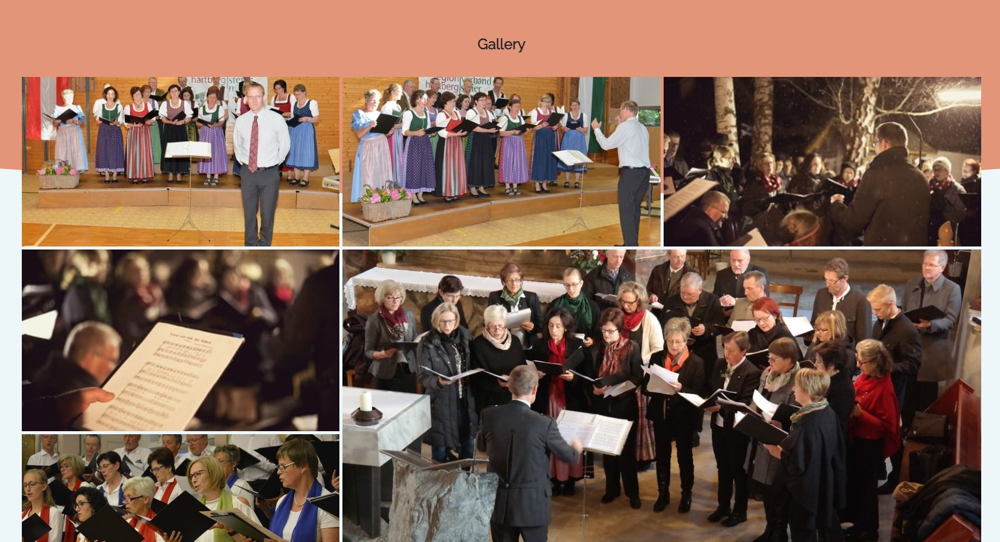

### **About Us Page Features**
The About Us Page introduces the choir, including its history. The page also lists the front persons (US5).
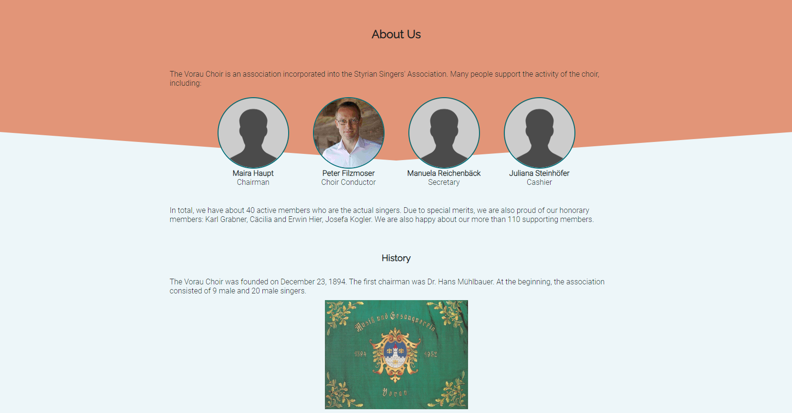

### Differences to Desing
There are several slight differences between the original and the actuall design:
- Generally, there is more text in the actuall than original desing.
- The hamburger menu was not considered in the original design.
- Four embeded videos for large devices were not implemented because of the difficulities of changing the video sizes.
- The layout of the footer was slightly modified by including more information (e.g. additional contact details)
- The layout of the Gallery Page was slightly modified.
- The contect of the About Us Page was better structured by including the History Section. 

### Future Enhancements
- German Language
    - As the webpage presents the choir from Austria, including the German language is more relevant for the users as the English.
- Scroll Top Button
    - When scrolling down the webpage on the mobile devices, the menu bar is not fixed to the top. Therefore, a scroll button would make the webpage even more user friendly.

---

## Testing
Generally, the testing was considered during the entire development of the webpage. After impementig a feature or style the component, the implementation was tested. In the end, more thorough manual testing was conducted. Finally, the existing validation tools were used.

### Manual Testing
- The website was tested on various devices (mobile, laptop, and desktop) on with vairous browsers were used (Chroma, Safary, Firefox, and Edge)
- Several aspects were considered during the test, such as: 
   - responsiveness
   - visual effects (consistency of margin and padding accross all pages)
   - hover effects on links and buttons
   - highlighting of the active page
   - form submission
   - opening link in a new tab

### Validator Testing
- CSS
    - The W3C CSS Validation did not find any errors, see [the detailed report](https://jigsaw.w3.org/css-validator/validator?uri=https%3A%2F%2Fbrodsa.github.io%2Fmgv-vorau%2F&profile=css3svg&usermedium=all&warning=1&vextwarning=&lang=en)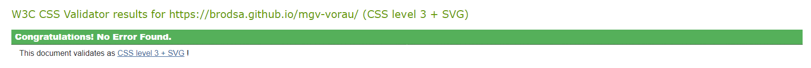

- HTML
   - The initial validation revelead several issues, which were fixed.
        - `button` tags cannot be a descendant of `a` tags and vice verse: `button` was removed
        - duplicated class attributes: a class was removed
        - `div` element is not allowed to be a child element of `label`: remove the div and style the menu bar for mobile devices differently

   - The final report did not show any errors or warnings for all three pages 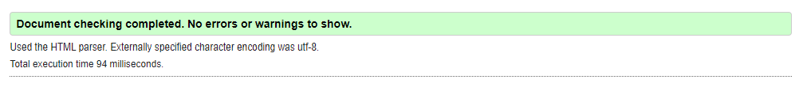
        - [Home Page](https://validator.w3.org/nu/?doc=https%3A%2F%2Fbrodsa.github.io%2Fmgv-vorau%2Findex.html)
        - [About Us Page](https://validator.w3.org/nu/?doc=https%3A%2F%2Fbrodsa.github.io%2Fmgv-vorau%2Fabout.html)
        - [Gallery Page](https://validator.w3.org/nu/?doc=https%3A%2F%2Fbrodsa.github.io%2Fmgv-vorau%2Fgallery.html)

- Lighthouse
    - The lighthouse report was generated using the Google Chrome Dev Tools. The test were run for both desktiop and mobile devices.
    - The initial report indicated the low performance due to the size of hero image. After the image compression, the performance got slightly better.
    - The score for the best practices was reduced due to the cookies from the social-media link.
    - Mobile devices 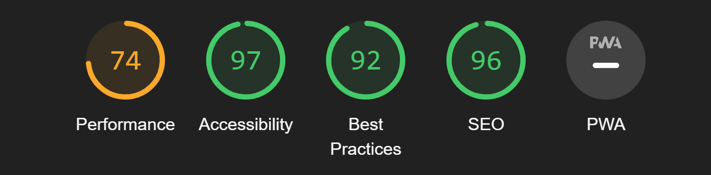
    - Desktop devices 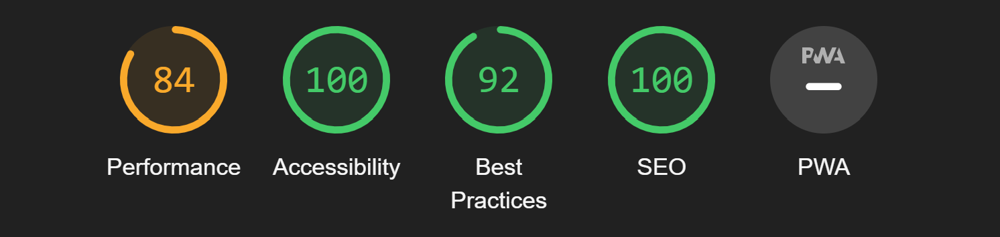

### Bugs and Issues
In general, the addaptation of margins and paddings was always slightly changed to received better appearence, which is, of course, very subjective to the developer. Such type of changes and the correction of typos were not considered as bug.

The list of all bugs wich were fixed und documented is listed in the table below.

| Bug  and Issue                                                                             | Solution                                                                                                                            |
|-----------------------------------------------------------------------------------|-------------------------------------------------------------------------------------------------------------------------------------|
| Colour accessibility                                                              | New colour pallete was chosen.                                                                                                      |
| The width of the menu bar is inconsistent in all pages when using mobile devices. | The margin was added to the header in About Us and Gallery Page.                                                                    |
| Calendar items are not large enough, causing the text is hidden.                  | The width of the item was increased.                                                                                                |
| Buttons of the form have different appearence on mobile devices than on notebooks | The problem was googled and a post solving the issue was found on [stack overflow](https://stackoverflow.com/questions/5438567/css-submit-button-weird-rendering-on-ipad-iphone). The property, `-webkit-appearance: none;` , was added to the css class.   |

It should be noted that during the development, the commit type was included in the message, following [the blog post](https://www.freecodecamp.org/news/how-to-write-better-git-commit-messages/). A slight difference was, unfortunately, considered. The style type commit, i.e.  `commit -m "style:"`, was used for the css styling of the webpage. The changes in the code style, like removing the comments, was considered as the refact type commit, i.e. `commit -m "refact:"`. 

---

## Deployment
The site was deployed to GitHub pages. The steps to deploy the webpage were following: 
- In the GitHub repository, go to the Settings section.
- Find the Page category on the left hand side.
- Under the Branch section, select the source branch from the drop-down menu (e.g. master branch )
- Once the master branch has been selected, the page url will be generated - this indicates the successful deployment. 
  
The website can be viewed [here](https://brodsa.github.io/mgv-vorau/).

---
## Languages
- HTML
- CSS
- Markdown

## References

### Credits & Inspirations
- [Responsive iframes](https://www.w3schools.com/howto/howto_css_responsive_iframes.asp) were considered for the map in the Get In Touch Section
- [Content and Images](http://www.mgv-vorau.at/) were taken from the original webpage.
- [Profile placeholder](https://www.pngfind.com/download/hJmwxix_image-placeholder-png-user-profile-placeholder-image-png/) was taken for the missing profile pictures. The pictures should be added soon.
- Lectures of Become a coder from [Czechitas](https://www.czechitas.cz/kurzy/stan-se-koderkou) helped me to refresh some concepts which were not part of the course from the Code Institute (e.g. flex, grid, favicon).
- [The hero section](https://www.castlechorus.co.uk/) inspired the Hero and Footer Section of the webpage.
- [The events calendar](https://www.nicepng.com/ourpic/u2t4i1a9w7o0i1i1_march-website-event-calendar-design/ ) inspired the Calendar section of the webpage.
- The way of presenting the information in footer was inspired by the [THRIVE Jucies nad Smoothies](https://elainebroche-dev.github.io/ms1-thrive/index.html)
- The style and structure of README were inspired by the alumni and mentors of the Code Institute: [eleinebroche-dev](https://github.com/elainebroche-dev/ms1-thrive), [MattBCoding](https://github.com/MattBCoding/leinster-trophy/blob/master/README.md), and [Daisy-McG](https://github.com/Daisy-McG/MilestoneProject-1)

### Technologies & Tools
- [Google Fonts]() was used to import the fonts into the style.css file.
- [Font Awesome](https://fontawesome.com/search) were used generate icons for the social media and the contact details.
- [Clip Path Generator](https://www.cssportal.com/css-clip-path-generator/) was used to generate the background of the Hero and Footer Section.
- [Image Compressor](https://tinypng.com/) was used to compressed the images.
- [Logo Creater](https://looka.com/) was used to create the logo.
- [Favicon](https://favicon.io/favicon-converter/) was used to generate the code and files for the webpage favicon.
Balsamiqwas used to create the wireframes during the design process
- [YouTube](https://www.youtube.com/) was used to generate HTML code for the embedded video.
- [Google Maps](https://www.google.com/maps) was used to generate HTML cor for the embedded map.
- [GitHub](https://github.com/) was used to store the code and hoste the website.
- [Gitpod](https://www.gitpod.io/) is IDE and was used to develop the website.
- [Formsubmit](https://formsubmit.co/) was used for the form submition.

### Acknowledgemetns
I would like to thank my mentor [Gereth McGirr](https://github.com/Gareth-McGirr) for his guidance throughout my project. I'd like to give a special mention to the student [Carl Murray](https://github.com/CarlMurray) for his time to provide me a valuable feedback.
