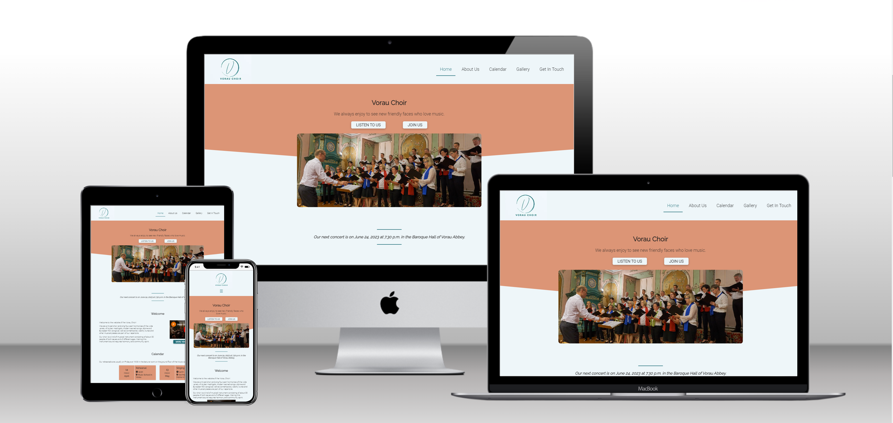
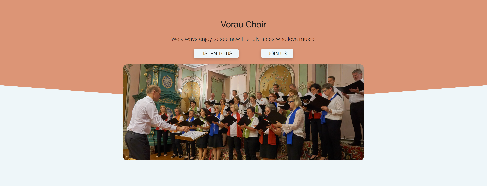
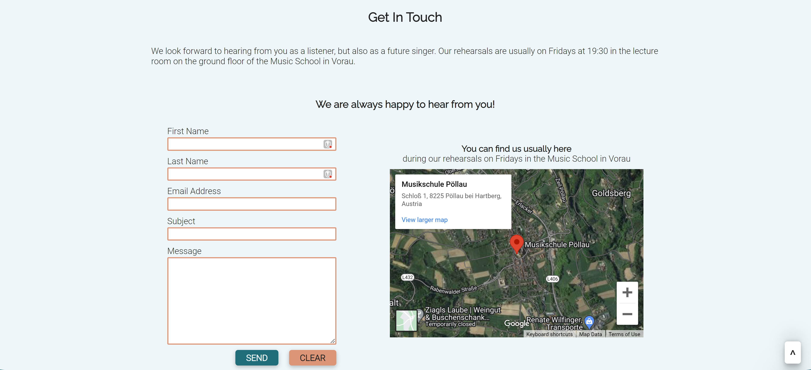
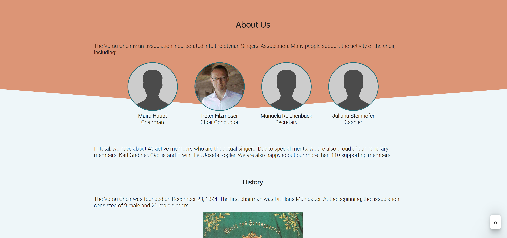
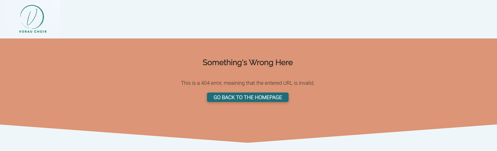
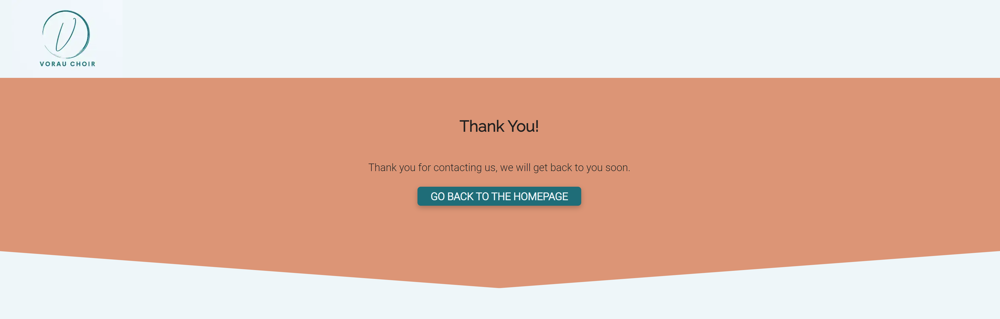

# Vorau Choir

## Table of Contents
- [Introduction](#introduction)
- [UX](#ux)
- [Features](#features)
- [Testing](#testing);
- [Deployment](#deployment)
- [References](#references)
- [Acknowledgements](#acknowledgemetns)

---

## Introduction

This website is the redesign of the existing homepage of [The Choir Vorau](http://www.mgv-vorau.at/), originally created in German. The Choir Vorau is a mixed-voice choir located in Vorau, Styria, Austria. The Vorau municipality is located in a culturally rich area, which attracts a lot of tourists. Vorau is especially famous for the historical abbey, where the choir organizes several concerts per year. The choir can also be heard during the regular singing rehearsal. Besides, the choir members organize other events, such as trips or singing with another choir. You can find the website [here](https://brodsa.github.io/mgv-vorau/).

 

## UX
The purpose of the newly designed home page is mainly to enhance the presentation of the choir's activities. This should attract fans, tourists, and potentially new members of the Choir Vorau. In the future, the current members of the choir will also have the opportunity to see a detailed gallery of all past events and concerts.

### User Stories

- **First-Time Visitor Goals**
    - US1: As a first-time visitor, I want to easily navigate through the content of the webpage.
    - US2: As a first-time visitor, I want to visit the web page on my mobile phone.
    - US3: As a first-time visitor, I want to see samples of the visual or audio presentation of some past concerts.

- **Returning Visitor Goals**
    - US4: As a returning visitor, I want to check the upcoming events.
    - US5: As a returning visitor, I want to read about the choir and its members.
    - US6: As a returning visitor, I want to easily contact the choir.
    - US7: As a returning visitor, I want to follow the choir's activities on social media.

- **Frequent Visitor Goals**
    - US8: As a frequent user, I want to check the new upcoming events.
    - US9: As a frequent user, I want to see new photos or media from the choir activities.

### Wireframes
The wireframes were created using the program balsamiq. Two versions of the webpage were considered: mobile (left) and notebook (right).

- Home Page

- About Us Page

- Gallery Page

### Color Pallete
The color pallete was changed during the development of the homepage several times. The [initial color schema](https://coolors.co/21b8a4-cecbcb-201f1f-f5f5f5) was chosen manually without checking the accessibility. After testing, it turned out that the colors are very poor in terms of accessibility. Therefore, new schema was selected based on the popular color pallete, see [here](https://coolors.co/palette/006d77-83c5be-edf6f9-ffddd2-e29578). The colors also fit to the chosen photo in the hero section of the homepage.

The accessibility of the chosen colors was tested by the tool [toolness](https://github.com/toolness/accessible-color-matrix). The usage of the color follows the advised color combinations, see the full report [here](https://toolness.github.io/accessible-color-matrix/?n=White&n=Black&n=Green&v=EBEBEB&v=201F1F&v=659B5E).

### Fonts
The heading font, Raleway, was selected after searching for the best fonts in 2023, see [here](https://kinsta.com/blog/best-google-fonts/#:~:text=Roboto.,appearances%20on%20Google%20Fonts'%20analytics.). The suitable body text font, Roboto, was chosen based on the [blog post](https://www.figma.com/google-fonts/raleway-font-pairings/#:~:text=Raleway%20font%20pairing,PT%20Sans%2C%20and%20Open%20Sans.) by Figma.

---
## Features
The layout of the webpage takes into account all eight user stories. Firstly, the entire webpage is designed to be responsive to ensure that the webpage is properly displaied on different devices (e.g. a mobile, a desktop). Secondly, the webpage consists of three sites, containing the common components, i.e. navigation menu and footer. This helps the user to easily navigate through the content of the webpage. Lastly, the webpage contains other components or elements which are common practice in web design, i.e. logo, hero picture, copyright notice or external links. 

### Common Features
-  **Navigation Menu**
    - All three web pages contain the logo and navigation menu (US1).
    - The navigation menu includes the following items (US1): 
        - *Home* navigates the user to the homepage.
        - *About Us* navigates the user to the About Us Page.
        - *Calendar* navigates the user to the Calender Section.
        - *Gallery* navigates the user to the Gallery Page.
        - *Get In Touch* navigates the user to the Get in Touch Section. 
    - The navigation menu is displayed as a hamburger on the small devices (US2).
    

- **Footer**
    - The footer is a common component of all three webpages as the navigation menu.
    - The footer contains the links to the social media (US7, US9), contact information (US6) and the copyright notice.
    

### **Home Page Features**
The Home Page consists of 4 sections including the listed features:
 - **Hero Section** includes the name, slogan and photo of the choir. Additionally, there are two buttons *Listen to Us* and *Join Us* ,which direct the user quickly to the Calender Section (US4, US9) and Get In Touch Section(US6) respectively.
 

 - **News Banner** serves for important announcements, such as upcomming concerts, new published on-line videos or concert cancellation (US8).

 - **Welcome Section** introduces the choir briefly. An embedded YouTube video of the choir singing is included (US3). 
 

 - **Calendar Section** lists all upcoming concerts and singing rehearsal (US4, US8).

 - *Get In Touch Section* includes contact form and the rehearsal location (US6). 
 

### **Gallery Page Features**
The Gallery Page contains a selection of the photos from the concerts or other events (US3, US9).

### **About Us Page Features**
The About Us Page introduces the choir, including its history. The page also lists the front persons (US5).

### **Hidden Pages**
- **404 Page**: The hidden 404 Page indicates the users that there is an error with their request.

- **Thank You Page**: The hidden Thank You Page informs the users about the successful form submission. 

### Differences to Design
There are several slight differences between the original and the actual design:
- Generally, there is more text in the actual design than in the original one.
- The hamburger menu was not considered in the original design.
- Four embedded videos were not implemented for large devices due to the difficulties of changing the video sizes, i.e. difficulties with the responsiveness of iframes for embedded videos. This will be implemented with a next iteration.
- The layout of the footer was slightly modified by including more information (e.g. additional contact details)
- The layout of the Gallery Page was slightly modified.
- The content of the About Us Page was differently structured by including the History Section. 

### Future Enhancements
- German Language
    - As the webpage presents the choir from Austria, including the German language is more relevant for the users than the English.

---

## Testing
Generally, testing was considered during the entire development of the webpage. After implementing a feature or styling the component, the the webpage was tested. In the end, more thorough manual testing was conducted. Finally, the existing validation tools were used.

### Manual Testing
- The website was tested on various devices (mobile: iPhone8, TODO; and laptop: Dell XPS13) and in various web browsers (Chroma, Safary, Firefox, and Edge). In additional, the Google Chrome DevTool was used to fill the gap with testing the website on even more screen sizes.

Following aspects were considered during the test: 

Responsiveness

* Testing procedure:
    +  Changing the screen size of the web browser and testing the following:      
        + The menu bar responds to the different screen sizes.
        + The layout (text, images, a embedded video) responds to the different screen sizes.
        +  The information and background in Footer Section responds to the different screen sizes.
    + Testing the same procedure on real devices.
* Expected results:
    + The menu bar reacts properly, changing from the menu bar to the hamburger menu.
    + The text is visible and readable.
    + The images and video are properly displayed.
* Actual results:
    + The webpage reacts as expected, except the responsiveness of video, see more in [Bugs and Issues](###bugsandissues).

Margin & Padding

* Testing procedure:
    + Clicking on all pages and checking the consistency of margin and padding across all pages.
    + The same procedure as for the responsiveness.
* Expected results:
    + Margin and padding are consistent across all pages.
* Actual results:
    + The behavior as expected.

Responds on User Activity

* Testing procedure
    + Hover over the links and buttons.
    + Click on all menu item and test the visibility of the active pages
    + Click on links and test if the external links open in a new tab.
* Expected results:
    + The hover effect is visible for the user.
    + The menu works properly and the active page is highlighted.
    + Links work properly and the new tab is opened for the external links.
* Actual results:
    + The behavior as expected.

Form Submission

* Testing procedure:
    + Send the form with one of the unfilled form inputs.
    + Send the form with incorrect email address.
    + Send the filled in form.
    + Clear the form.
* Expected results:
    + The form is not sent in case of incorrect inputs or empty inputs. The user is always warned.
    + The user is informed after sending the form successfully.
    + All inputs are empty after clearing the form.
* Actual results:
    + The behavior is as expected.

### Validator Testing
- CSS
    - The W3C CSS Validation did not find any errors.

    - The final detailed reports of all three pages:
        - [Home Page](https://jigsaw.w3.org/css-validator/validator?uri=https%3A%2F%2Fbrodsa.github.io%2Fmgv-vorau%2Findex.html&profile=css3svg&usermedium=all&warning=1&vextwarning=&lang=en)
        - [About Us Page](https://jigsaw.w3.org/css-validator/validator?uri=https%3A%2F%2Fbrodsa.github.io%2Fmgv-vorau%2Fabout.html&profile=css3svg&usermedium=all&warning=1&vextwarning=&lang=en)
        - [Gallery Page](https://jigsaw.w3.org/css-validator/validator?uri=https%3A%2F%2Fbrodsa.github.io%2Fmgv-vorau%2Fgallery.html&profile=css3svg&usermedium=all&warning=1&vextwarning=&lang=en)

- HTML
   - The initial validation detected several issues which were fixed, see below.

        | Issue | Solution |
        |------|----------|
        |`button` tags cannot be a descendant of `a` tags and vice verse| `button` tag was removed
        |duplicated class attributes| a class was removed|
        |`div` element is not allowed to be a child element of `label`| `div` was removed and the menu bar was styled differently for mobile devices| 

   - The final report did not show any errors or warnings

   - The final detailed reports of all three pages: 
        - [Home Page](https://validator.w3.org/nu/?doc=https%3A%2F%2Fbrodsa.github.io%2Fmgv-vorau%2Findex.html)
        - [About Us Page](https://validator.w3.org/nu/?doc=https%3A%2F%2Fbrodsa.github.io%2Fmgv-vorau%2Fabout.html)
        - [Gallery Page](https://validator.w3.org/nu/?doc=https%3A%2F%2Fbrodsa.github.io%2Fmgv-vorau%2Fgallery.html)

- Lighthouse
    - The lighthouse report was generated using the Google Chrome Dev Tools. The test were run for both desktop and mobile devices.
    - The initial report indicated the low performance due to the size images. After the decreasing the size of images, converting to the webp format and compressing, the performance got remarkable better.
    - **Mobile devices** 
        - Home Page 
        - About Us Page 
        - Gallery Page 
    - **Desktop devices** 
        - Home Page 
        - About Us Page 
        - Gallery Page 

### Bugs and Issues
In general, the adaptation of margin and padding was always slightly changed to received better appearance, which is, of course, very subjective to the developer. Such type of changes and the correction of typos were not considered as bug.

The list of additional bugs/issues, which were fixed, is listed in the table below.

| Bug  and Issue                                                                             | Solution                                                                                                                            |
|-----------------------------------------------------------------------------------|-------------------------------------------------------------------------------------------------------------------------------------|
| Color accessibility                                                              | New color pallete was chosen, see [coolors](https://coolors.co/palette/006d77-83c5be-edf6f9-ffddd2-e29578).                                     
| Buttons of the form have different appearence on mobile devices than on notebooks | The problem was googled and a post solving the issue was found on [stack overflow](https://stackoverflow.com/questions/5438567/css-submit-button-weird-rendering-on-ipad-iphone). The property, `-webkit-appearance: none;`, was added to the CSS class.   
| A low performance scores in Lighthouse testing | The size of images were decrease and all images were converted to the webp format 
| Responsiveness of the YouTube video for very small devices (i.g. smaller than 280px) does not work properly.| unfixed, the solution will be considered in a next iteration due to the lack of time.

---

## Deployment
The site was deployed to GitHub Pages. The steps to deploy the webpage were following: 
- In the GitHub repository, go to the Settings Section.
- Find the Page Category on the left hand side.
- Under the Branch Section, select the source branch from the drop-down menu (e.g. master branch).
- Click on Save Button.
- Once the master branch has been selected, the page url will be generated - this indicates the successful deployment. 
  
The website can be viewed [here](https://brodsa.github.io/mgv-vorau/).

It should be noted that during the development, the commit type was included in commit messages, following [the blog post](https://www.freecodecamp.org/news/how-to-write-better-git-commit-messages/) with a slight difference. The style type commit, i.e.  `commit -m "style:"`, was used for the css styling of the webpage. The changes in the code style, such as removing the comments, was considered as the refact type commit, i.e. `commit -m "refact:"`. 

## Clone the Repository
The repository can also be cloned locally, the steps are following:

1. On Git
    - Go to the repository you want to clone, e.g. https://github.com/brodsa/mgv-vorau
    - You see the content of the repository, i.e. all the files are listed. On the right side at the top of the list, find the Code drop down button and click on it.
    - Copy the repository HTTPS link to the clipboard.
2. In the terminal (Note: git must be preinstalled) 
    - Open the terminal and navigate, where you want to clone the repository.
    - Type `git clone` and insert the content from the clipboard, leading to the command `git clone https://github.com/brodsa/mgv-vorau.git`. 
    - Once the project is cloned, you can start using the repository locally.

---
## Languages
- HTML
- CSS
- Markdown
- JavaScript

---
## References

### Credits & Inspirations
- [Content and Images](http://www.mgv-vorau.at/) were taken from the original webpage.
- [Box shadow](https://getcssscan.com/css-box-shadow-examples) ware taken for the buttons.
- [Scroll back to the top button](https://www.w3schools.com/howto/howto_js_scroll_to_top.asp) was taken in order to be even more user-friendly and navigate through the webpage quickly.
- [Responsive iframes](https://www.w3schools.com/howto/howto_css_responsive_iframes.asp) were considered for the map in the Get In Touch Section
- [Profile placeholder](https://www.pngfind.com/download/hJmwxix_image-placeholder-png-user-profile-placeholder-image-png/) was taken for the missing profile pictures. The pictures should be included in a next iteration.
- Lectures of Become a coder from [Czechitas](https://www.czechitas.cz/kurzy/stan-se-koderkou) helped me to refresh some concepts which were, unfortunately, not a part of the course from the Code Institute (e.g. flex, grid, favicon).
- [The hero section](https://www.castlechorus.co.uk/) inspired the Hero and Footer Section of the webpage.
- [The events calendar](https://www.nicepng.com/ourpic/u2t4i1a9w7o0i1i1_march-website-event-calendar-design/ ) inspired the Calendar section of the webpage.
- The way of presenting the information in footer was inspired by the [THRIVE Jucies nad Smoothies](https://elainebroche-dev.github.io/ms1-thrive/index.html)
- The style and structure of README were inspired by the alumni and mentors of the Code Institute: [eleinebroche-dev](https://github.com/elainebroche-dev/ms1-thrive), [MattBCoding](https://github.com/MattBCoding/leinster-trophy/blob/master/README.md), [Daisy-McG](https://github.com/Daisy-McG/MilestoneProject-1), and my mentor [Gareth McGirr](https://github.com/Gareth-McGirr).

### Technologies & Tools
- [Google Fonts]() was used to import the fonts into the style.css file.
- [Font Awesome](https://fontawesome.com/search) were used generate icons for the social media and the contact details.
- [Color Pallete](https://coolors.co/palette/006d77-83c5be-edf6f9-ffddd2-e29578) was used to select accessible colors.
- [Clip Path Generator](https://www.cssportal.com/css-clip-path-generator/) was used to generate the background of the Hero and Footer Section.
- [Image Compressor](https://tinypng.com/) was used to compress the images.
- [Image Converter](https://ezgif.com/) was used to convert all images in the webp format.
- [Logo Creator](https://looka.com/) was used to create the logo.
- [Favicon](https://favicon.io/favicon-converter/) was used to generate the code and files for the webpage favicon.
Balsamiq was used to create the wireframes during the design process
- [YouTube](https://www.youtube.com/) was used to generate HTML code for the embedded video.
- [Google Maps](https://www.google.com/maps) was used to generate HTML cor for the embedded map.
- [GitHub](https://github.com/) was used to store the code and host the website.
- [Gitpod](https://www.gitpod.io/) is IDE and was used to develop the website.
- [Formsubmit](https://formsubmit.co/) was used for the form submission.

### Acknowledgemetns
I would like to thank my mentor [Gareth McGirr](https://github.com/Gareth-McGirr) for his guidance throughout my project. I'd like to give a special mention to the student [Carl Murray](https://github.com/CarlMurray) for his time to provide me a valuable feedback.
