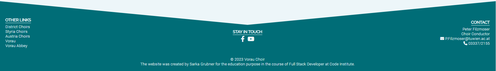

# Vorau Choir

## Introduction

This website is the redesign of the existing homepage of [The Choir Vorau](http://www.mgv-vorau.at/), originally created in German. The Choir Vorau is a mixed-voice choir located in Vorau, Styria, Austria. The Vorau municipality is located in a culturally rich area, which attracts a lot of tourists. Vorau is especially famous for the historical abbey, where the choir organizes several concerts per year. The choir can also be heard during the regular singing rehearsal. Besides, the choir members organize other events, such as trips or singing with another choir. You can find the website [here](https://brodsa.github.io/mgv-vorau/).

--- 
 

## UX
The purpose of the newly designed home page is mainly to enhance the presentation of the choir's activities. This should attract fans, tourists, and potentially new members of the Choir Vorau. In the future, the current members of the choir will also have the opportunity to see a detailed gallery of all past events and concerts.

### User Stories

- **First-Time Visitor Goals**
    - US1: As a first-time visitor, I want to easily navigate through the content of the webpage.
    - US2: As a first-time visitor, I want to visit the web page on my mobile phone.
    - US3: As a first-time visitor, I want to see samples of the visual or audio presentation of some past concerts.

- **Returning Visitor Goals**
    - US4: As a returning visitor, I want to check the upcoming events.
    - US5: As a returning visitor, I want to read about the choir and its members.
    - US6: As a returning visitor, I want to easily contact the choir.
    - US7: As a returning visitor, I want to follow the choir's activities on social media.

- **Frequent Visitor Goals**
    - US8: As a frequent user, I want to check the new upcoming events.
    - US9: As a frequent user, I want to see new photos or media from the choir activities.

### Wireframes
The wireframes were created using the program balsamiq. Two versions of the webpage were considered: mobile (left) and notebook (right).

- Home Page

- About Us Page

- Gallery Page

### Colours
The colour pallete was changed during the development of the homepage several times. The [initial colour schema](https://coolors.co/21b8a4-cecbcb-3d4849-f5f5f5) was chosen manually without checking the accessibility. After testing, it turned out that the colours are very poor in terms of accessibility. Therefore, new shema was selected based on the popular colour pallete (see [here]())

### Fonts
The heading font, Raleway, was selected after searching for the best fonts in 2023, see [here](https://kinsta.com/blog/best-google-fonts/#:~:text=Roboto.,appearances%20on%20Google%20Fonts'%20analytics.). The suitable body text font, Roboto, was chosen based on the [blog post](https://www.figma.com/google-fonts/raleway-font-pairings/#:~:text=Raleway%20font%20pairing,PT%20Sans%2C%20and%20Open%20Sans.) by Figma.

## Features
The layout of the webpage takes into account all eight user stories. Firstly, the entire webpage is desinged in a responsive way to ensure that the webpage is properly displaied on different devices (e.g. a mobile, a desktop). Secondly, the webpage consists of three sites, containing the common components, i.e. navigation menu and footer. This helps the user to easily navigate through the content of the webpage. Lastly, the webpage contains other components or elements which are common practise in webdesign, i.e. logo, hero picture, copyright notice or external links. 

### Common Features
-  **Navigation Menu**
    - All three web pages contain the logo and navigation menu (US1).
    - The navigation menu includes the following items (US1): 
        - *Home* navigates the user to the homepage.
        - *About Us* navigates the user to the About Us Page.
        - *Calendar* navigates the user to the Calender Section.
        - *Gallery* navigates the user to the Gallery Page.
        - *Get In Touch* navigates the user to the Get in Touch Section. 
    - The navigation menu is displayd as hamburger on the small devices (US2).
    

- **Footer**
    - The footer is a common component of all three webpages as the navigation menu.
    - The footer contains the links to the social media (US7, US9), contact information (US6) and the copyright notice.
    

### **Home Page Features**
The Home Page consists of 4 sections including the listed features:
 - **Hero Section** includes the name, slogan and photo of the choir. Additionaly, there are two buttons *Listen to Us* and *Join Us* resp. which directs the user to Calender (US4, US9) and Get In Touch (US6) resp. Section quickly.
 

 - **News Banner** serves for important announcements, such as upcomming concerts, new published on-line videos or concert cancellation (US8).

 - **Welcome Section** introduces the choir briefly. An embedend Youtube video of the choir sining is included (US3). 
 

 - **Calendar Section** lists all upcoming concerts and singing rehearsal (US4, US8).

 - *Get In Touch Section* includes contact form and the rehearsal location (US6). 
 

### **Gallery Page Features**
The Gallery Page contains a selection of the photos from the concerts or other events (US3, US9).

### **About Us Page Features**
The About Us Page introduces the choir, including its history. The page also lists the front persons (US5).

### Differences to Desing
There are several slight differences between the original and the actuall design:
- Generally, there is more text in the actuall desing.
- The hamburger menu was not considered in the original design.
- Four embeded videos for large devices were not implemented because of the difficulities of changing the video sizes.
- The layout of the footer was slightly modified.
- The layout of the Gallery Page was slightly modified.

### Future Enhancements

### Design

---

## Testing

### Manual Testing

### Validator Testing

---
## Bugs

- accesibility (the original selected colors were not), solution: new color pallete;

- in generally, margin and padding was always slightly changed to received better appearence (very subjective to the developer) and typos;

- the width is not consistent in all pages when using mobile devices; solution: added marging to the header in the about and about us page

- calender items are not large enough, text is hidden; solution: make the widht larger

- buttons in the form have different appearence on mobile devices than on notebooks; solution: add `-webkit-appearance: none` to the css class; according to [stack overlow](https://stackoverflow.com/questions/5438567/css-submit-button-weird-rendering-on-ipad-iphone)

- style commit: related to css styles; solution: used in refact

---

## Deployment

---

## Credits
- [Responsive iframes](https://www.w3schools.com/howto/howto_css_responsive_iframes.asp)

- [Icons](https://fontawesome.com/search)

- Content

- images 

- [profile placeholder](https://www.pngfind.com/download/hJmwxix_image-placeholder-png-user-profile-placeholder-image-png/)

### Inspirations
https://www.castlechorus.co.uk/

## Technology Used

[Fonts Parings](https://www.figma.com/file/0g4HdMrtXQdrXMSG3foFZsmD/Raleway-Pairings/duplicate?node-id=0-1)

[Image Compressor](https://tinypng.com/)

[Logo Creater](https://looka.com/)

[Favicon](https://favicon.io/favicon-converter/)

[Color Palette](https://coolors.co/palette/006d77-83c5be-edf6f9-ffddd2-e29578)

